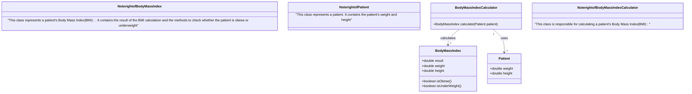

---
#Body Mass Index Calculator
---

```mermaid
classDiagram
    class BodyMassIndex {
        +double result
        +double weight
        +double height
        +boolean isObese()
        +boolean isUnderWeight()
    }
    Note right of BodyMassIndex: "This class represents a patient's Body Mass Index (BMI). It contains the result of the BMI calculation and the methods to check whether the patient is obese or underweight"

    class Patient {
        +double weight
        +double height
    }
    Note right of Patient: "This class represents a patient. It contains the patient's weight and height"

    class BodyMassIndexCalculator {
        +BodyMassIndex calculate(Patient patient)
    }
    Note right of BodyMassIndexCalculator: "This class is responsible for calculating a patient's Body Mass Index (BMI)"
    BodyMassIndexCalculator "1" --> "1" BodyMassIndex: calculates
    BodyMassIndexCalculator "1" --> "1" Patient: uses
```